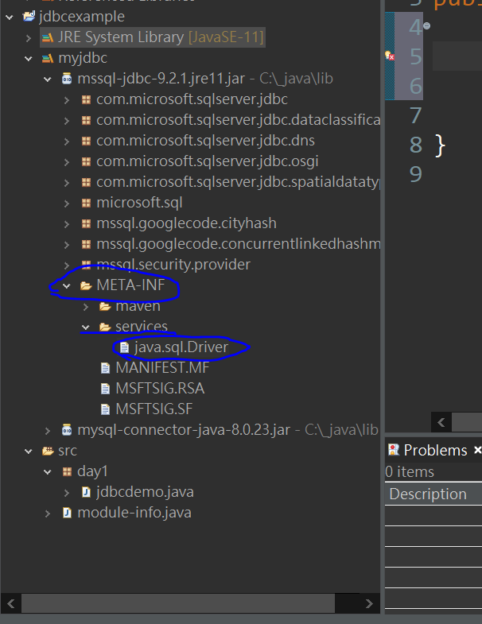

# JDBC



## JDBC的部署

## JDBC的註冊



在裡面可以找這串文字

```java
com.microsoft.sqlserver.jdbc.SQLServerDriver
```

把它貼在這裡

```java
package day1;

public class jdbcdemo {
	public static void main(String[] args) {
		try {
		Class.forName("com.microsoft.sqlserver.jdbc.SQLServerDriver");
		   System.out.println("OK"); 
		}catch( ClassNotFoundException e   ) {
			e.printStackTrace();
		}
		
		
	}

}
```


