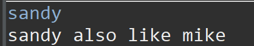

# switch

```text
import java.util.Scanner;

public class switchtraining {
	public static void main(String[] args) {
		Scanner sc=new Scanner(System.in);
		String str1=sc.next();
		switch(str1) {
		case "mike":
			System.out.println("mike like cindy");
			break;
		case "sandy":
			System.out.println("sandy also like mike");
			break;
		default:
			System.out.println("my mom likes mike");
			break;
		}
		
	}

}
```



請記得要加上break!

